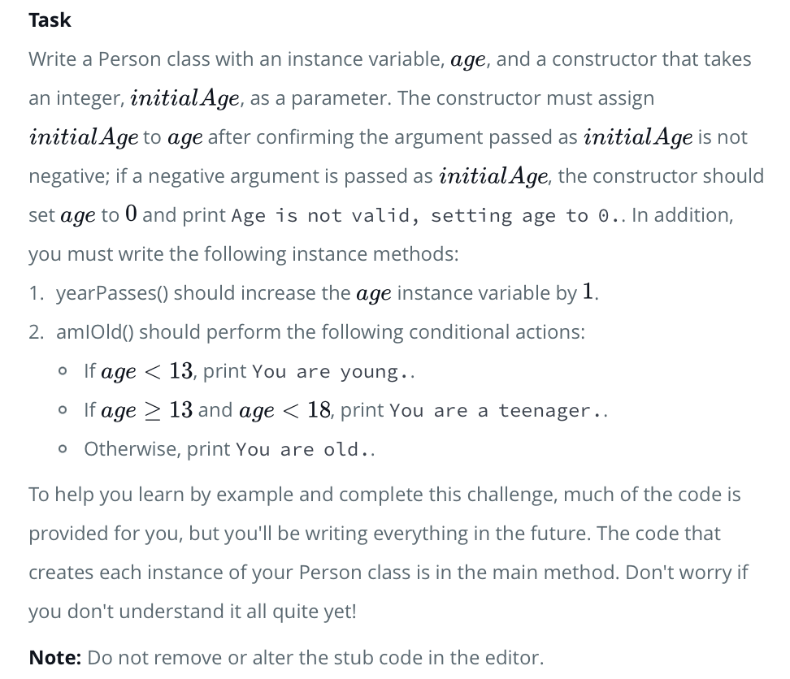

# HackerRank - Class VS Instance
<br>

> ## Problem from HackerRank

- Task:
 

<br>
<hr>

> ## Solution:
<br>

```
class Person:
    def __init__(self, initialAge):
        if(initialAge < 0):
            print("Age is not valid, setting age to 0.")
            self.age = 0
        else:
            self.age = initialAge
            
    def amIOld(self):
        if self.age >= 18:
            print("You are old.")
        elif self.age >= 13:
            print("You are a teenager.")
        else: # age < 13
            print("You are young.")
            
    def yearPasses(self):
        self.age += 1
```
<hr>

> ## Explanation
<br>

```
...

```
<hr>

- cf .
    - https://www.hackerrank.com/challenges/30-class-vs-instance/problem


