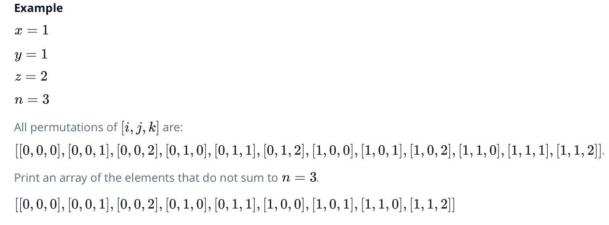

# HackerRank - List Comprehensions
<br>

> ## List Comprehension VS For Loop in Python

- Problem:
```
You are given three integers x, y and z representing the dimensions of a cuboid along with an integer n. Print a list of all possible coordinates given by (i, j, k) on a 3D grid where the sum of i + j +k is not equal to n. 
Here, 0<=i<=x; 0<=j<=y; 0<=k<=z. Please use list comprehensions rather than multiple loops, as a learning exercise.
```

- Example:

<br>
<hr>
- Solution 1: Multiple Loop
if __name__ == '__main__':
    x = int(input())
    y = int(input())
    z = int(input())
    n = int(input())

answer_list = []

answer_list = ([[a,b,c] for a in range(x+1) for b in range(y+1) for c in range(z+1) if (a + b + c) != n])

print(answer_list)

<br>
<hr>
- Solution 2: List Comprehension
answer_list = []

for a in range(x+1):
    for b in range(y+1):
        for c in range(z+1):
            if a + b + c != n:
                (answer_list).append([a, b, c])

print(answer_list)
<br>
<hr>

- cf .
    - https://www.programiz.com/python-programming/list-comprehension


>> 1. Using for-statement 

>> 2. Using recursive function

>> 3. Using math library

---
## Solution 1: For Statement
```
a = int(input("팩토리얼을 구할 숫자를 입력하세요 : ")) 
result = 1 
for item in range(1, a+1, 1): 
    result *= item                    #result = result * item 
print(result)
```
---
## Solution 2: Recursive Function
```
def my_factorial(n): 
    if(n > 1): 
        return n * my_factorial(n - 1) 
    else: 
        return 1 

a = int(input("팩토리얼을 구할 숫자를 입력하세요 : ")) 
print(my_factorial(a))
```
---
## Solution 3: Math Library
```
import math 
a = int(input("팩토리얼을 구할 숫자를 입력하세요 : ")) 
print(math.factorial(a))
```
